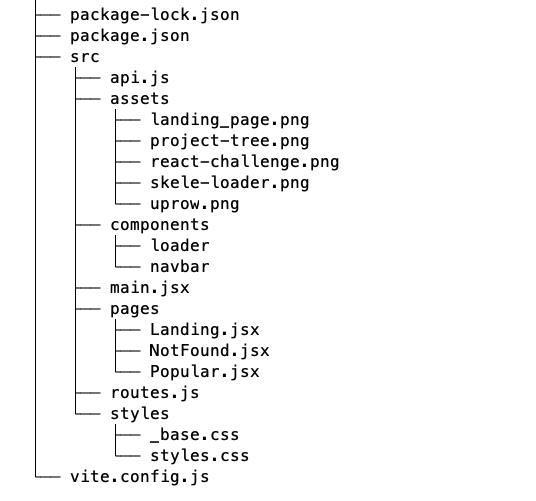

<h1 align='center'>
React-Challenge
</h1>

<br />


<h3>About</h3>

----


Simple React application with links to top-rated front-end resources around GitHub. 
Bundled 
with Vite.      

Deployed and host with Netlify <kbd>></kbd> <a href="https://hilarious-kashata-1ca79f.netlify.app" title="React challenge">Link to 
App</a>

<br />

<h3>Install</h3>

----

```
    npm install && npm run dev
```

<br />

Most dependencies installed are part of my eslint-config plugin. To uninstall plugin:

```
 npm uninstall eslint-config-slco
```

<br />

<h3>Project</h3>




<br />


<br />
:100:
